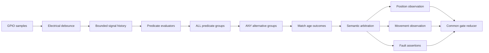

# Configurable feedback signal decoder architecture

## 1. Purpose

This document plans a user-configurable, deterministic decoder for simple GPIO wire protocols. It focuses only on feedback acquisition, waveform classification, semantic observation production, and the boundary into the existing gate reducer. Actuator policy changes, including how a deliberate sequential pause is presented to Apple Home, are intentionally deferred.

The immediate motivating protocol is the Ducati CTH48 status output:

- a constant inactive level represents CLOSED;
- a constant active level represents OPENED;
- a slow pulse train represents OPENING;
- a fast pulse train represents CLOSING.

The architecture must not hard-code Ducati timing or semantics. A user declares feedback GPIOs, creates reusable waveform conditions, combines conditions into bounded Boolean rules, and assigns rule outcomes to firmware-defined gate observations or faults.

The design replaces the assumption in [the current endpoint normalizer](../components/gate_controller/operator_domain.cpp) that every single input is an endpoint level. It preserves the existing semantic actuator architecture in [the operator-profile plan](operator-profile-architecture.md).

## 2. Confirmed product decisions

1. **Decoding is configuration-driven.** The firmware supplies a safe set of condition types and semantic outcomes; the user supplies GPIO bindings and timing values.
2. **GPIOs are shared evidence sources.** Any declared input may be referenced by any number of rules. A rule never owns or consumes a GPIO.
3. **Rules evaluate concurrently.** For example, one rule may classify toggling on GPIO 4 as CLOSING, while another independently classifies GPIO 4 held low for 2 seconds as OBSTRUCTED.
4. **Current evidence is decoded independently.** A movement rule does not invoke, complete, or cancel an endpoint rule. A later independent stable-level rule may prove OPENED or CLOSED.
5. **Semantic composition happens only after decoding.** Position, movement, and fault rules are evaluated from shared input history without reading another rule's match, output, lifecycle, or selected public state. Endpoint authority and fault clearing are downstream arbitration/reducer policies, never inputs to rule evaluation.
6. **Rules may have match-age outcomes.** A waveform can mean OPENING while it has continuously matched for less than a configured duration, then produce UNKNOWN and/or OBSTRUCTED after that duration.
7. **Endpoint proof clears rule-derived obstruction.** A valid OPENED or CLOSED observation automatically clears obstruction produced by waveform rules. Configuration and ambiguity faults remain separate and are not cleared this way.
8. **Motion and fault are separate semantic channels.** OPENED, CLOSED, OPENING, CLOSING, STOPPED, and UNKNOWN are mutually exclusive motion/position observations. OBSTRUCTED is an orthogonal fault assertion and may coexist with one motion observation.
9. **No decoder result can actuate the gate.** Rule match, rule expiry, ambiguity, endpoint proof, and obstruction clearing produce observations or faults only. They never generate STEP, OPEN, CLOSE, or any corrective pulse.
10. **The initial rule language is bounded.** It supports stable-level and periodic-toggle conditions, conjunction within a group, and alternatives across groups. It does not implement arbitrary expression trees, user scripts, XOR, negation over time, or a general finite-state machine.
11. **Physical isolation remains outside decoding.** A 12 V lamp/status output must reach the ESP32 through a suitable isolated input stage. Configuration cannot make an unsafe electrical connection safe.

## 3. Goals and non-goals

### 3.1 Goals

- Decode solid levels and pulse trains from one or more GPIO inputs.
- Let users assign independently authored rules to known gate observations and fault assertions.
- Support reuse of one GPIO across endpoint, movement, stopped, and obstruction rules.
- Represent timing uncertainty explicitly with tolerances, minimum evidence, and match/loss confirmation.
- Make decoding deterministic when rules overlap or conflict.
- Preserve external/radio movement direction when a board exposes it.
- Use fixed capacities and bounded history suitable for ESP32 firmware.
- Keep the decoder pure and host-testable; electrical sampling and scheduling remain adapters around it.
- Expose enough diagnostics for users to tune a protocol safely.
- Version persistence so later condition kinds and semantic fault types can be added deliberately.

### 3.2 Non-goals for the first implementation

- Arbitrary user-defined state names or executable scripts.
- A generic finite-state-machine language.
- XOR or arbitrary nested Boolean expressions.
- Frequency-domain analysis, duty-cycle classification, analog thresholds, counters across reboot, or protocol buses.
- Automatic discovery that silently changes the active configuration.
- Fusion with external endpoint reeds using confidence weighting or source priority.
- Configurable actuator behavior based directly on decoder rules.
- Changing the sequential pause/HomeKit obstruction policy in the same implementation series.

## 4. Conceptual model

The system has six transformations:

1. **Declared input** maps a logical input identifier to one GPIO and electrical settings.
2. **Electrical sampler** produces timestamped debounced level transitions.
3. **Signal-history tracker** maintains bounded, wrap-safe evidence per declared input.
4. **Predicate evaluator** classifies one input history as stable-level or periodic-toggle evidence. The UI may call these conditions, but decoder code uses predicate because each item is a Boolean test.
5. **Compiled rule evaluator** combines predicates and applies only the lifecycle behavior required by that semantic rule family.
6. **Arbitrator** resolves concurrent outputs into separate position, movement, and fault channels, then derives the public gate observation.



The signal decoder must not know which actuator profile is selected. Sequential STEP and directional OPEN/CLOSE operators consume the same decoded observation stream.

## 5. Firmware-defined semantic outputs

### 5.1 Position observations

Position evidence has its own internal channel:

| Observation | Meaning |
|---|---|
| OPENED | Feedback proves the fully opened endpoint |
| CLOSED | Feedback proves the fully closed endpoint |

OPENED and CLOSED are mutually exclusive. Simultaneous proof is a decoder contradiction/ambiguity fault.

### 5.2 Movement observations

Movement evidence has a separate internal channel:

| Observation | Meaning |
|---|---|
| OPENING | Feedback proves movement toward open |
| CLOSING | Feedback proves movement toward closed |
| STOPPED | Feedback proves the operator is not moving between endpoints |

OPENING, CLOSING, and STOPPED are mutually exclusive. UNKNOWN is an arbitration result meaning that neither authoritative position nor trustworthy movement is currently selected; it is not a positive hardware observation. A movement rule match-age expiry may request UNKNOWN by withdrawing its prior movement evidence.

### 5.3 Orthogonal fault assertions

The initial assignable fault list contains OBSTRUCTED. The persisted representation reserves a versioned semantic identifier so additional firmware-known faults can be added later without permitting arbitrary strings.

The reducer and projections retain a structured reason. Apple Home receives its single obstruction boolean as a projection of active fault reasons; REST and diagnostics expose the specific source.

### 5.4 Why the channels are separate

A closed gate may also expose an obstruction input. Likewise, a movement waveform may age into obstruction while the last trustworthy position remains known. Treating OBSTRUCTED as orthogonal prevents valid endpoint evidence from becoming ambiguous merely because a fault is simultaneously asserted.

Position and movement are also distinct internally. Endpoint rules do not compete numerically with movement rules. A selected endpoint is authoritative for the public state and suppresses stale movement publication. Conflicts within the position channel or within the movement channel remain ambiguity faults. This is structural endpoint authority, not user-configurable priority.

This authority is applied only after every rule has independently produced its result. It does not stop, reset, satisfy, suppress, or otherwise alter any rule evaluator. Likewise, clearing a public rule-derived obstruction on endpoint proof does not modify the obstruction rule's predicate result; if its electrical evidence still matches after endpoint proof disappears, arbitration may assert it again.

## 6. Configuration model

The names below describe the intended concepts; final C++ spelling should follow repository conventions during implementation.

### 6.1 Declared feedback inputs

Each input contains:

- stable numeric identifier used by rules;
- user-facing label;
- GPIO number;
- pull mode;
- electrical debounce duration;
- enabled flag or active-count membership;
- optional diagnostic inversion for display only, not semantic endpoint mapping.

Rules evaluate logical sampled levels 0 and 1 after any explicitly configured electrical inversion. Endpoint meaning is never embedded in an input declaration.

Recommended first-version capacity: four declared feedback inputs. The exact capacity must be centralized, validated, reported through capabilities, and encoded in persistence rather than scattered as literals.

### 6.2 Predicate kinds

#### Stable level

Parameters:

- input identifier;
- required logical level 0 or 1;
- minimum continuous hold duration;
- optional maximum age is not supported initially.

A stable-level predicate becomes true only after the debounced level has continuously equaled the configured level for the hold duration. An opposite debounced edge makes it false immediately.

Example: GPIO 4 equals 1 continuously for 2500 ms.

#### Periodic toggling

Parameters:

- input identifier;
- timing basis: edge interval for the first version;
- expected edge interval;
- allowed absolute tolerance or explicit minimum/maximum interval;
- minimum qualifying edge count;
- observation window;
- maximum missing-edge gap;
- optional edge symmetry requirement deferred unless real measurements require it.

The term **edge interval** is preferred over cycle time because a square wave with a one-second full cycle has edges approximately 500 ms apart. The UI may show a derived full-cycle estimate, but persistence and evaluation must use one unambiguous timing basis.

A periodic predicate becomes true only when enough recent intervals fall inside the configured range within the observation window. It remains true while qualifying edges continue and the maximum missing-edge gap is not exceeded.

Example: at least three edges whose intervals are 800–1200 ms, observed in the last 3500 ms, with no gap greater than 1400 ms.

### 6.3 Predicate groups and Boolean semantics

A rule contains one or more alternative groups:

- every predicate inside a group must be true: ALL/AND;
- at least one group must be true: ANY/OR.

This disjunctive-normal form is expressive enough for practical multi-wire protocols while remaining easy to validate and render.

Example:

- group A: status GPIO toggles at the opening rate;
- OR group B: direction GPIO is high AND movement GPIO is toggling.

XOR is excluded initially. Exclusive alternatives can be represented by specific positive conditions where needed, and conflicting semantic rule outputs are handled by arbitration rather than hidden operator precedence.

Recommended capacities for the first version are centralized in one `DecoderLimits` definition consumed by configuration validation, persistence, compilation, runtime storage, API capability reporting, and UI limits:

- eight rules;
- two alternative groups per rule;
- three predicates per group.

These values are starting points to validate against memory and UI complexity, not promises to hard-code throughout the implementation.

### 6.4 Rule outcome

The user sees one rule model. Each rule has exactly one primary assignment:

- a position observation;
- a movement observation; or
- a fault assertion.

A rule also has:

- stable identifier and user-facing label;
- enabled flag;
- one or more predicate groups;
- optional match-age stage.

Rules are independent even when they reference the same inputs and conditions.

Rule evaluators may read only timestamped input history, their own immutable compiled predicates, their own internal lifecycle state where applicable, and the supplied current timestamp. They may not read another rule evaluator or the arbitrated output. This acyclic dependency is a required implementation invariant.

Validated user rules compile into specialized internal evaluators:

- **Position rule evaluator:** predicate truth directly provides endpoint evidence. Stable-level hold time already supplies entry qualification, so position rules carry no additional generic entry confirmation, loss confirmation, match age, or priority machinery.
- **Movement rule evaluator:** supports entry confirmation, loss confirmation, and optional match-age behavior because pulse-train evidence can appear and disappear near timing boundaries.
- **Fault rule evaluator:** predicate truth directly asserts or withdraws a fault. Its predicates provide their own qualification timing; latching and acknowledgement policies are deferred.

This keeps the user workflow unified while avoiding per-rule runtime state that endpoint and simple fault rules do not need.

### 6.5 Optional match-age stage

After a rule becomes confirmed matched, its continuous match age starts at zero. A rule may define one threshold:

- before or at threshold: emit the primary outcome;
- after threshold: withdraw the primary motion outcome and select one configured expiry behavior.

Initial expiry behavior options:

- emit UNKNOWN motion evidence;
- assert OBSTRUCTED;
- emit UNKNOWN and assert OBSTRUCTED.

For position-primary and fault-primary rules, match-age staging is unavailable in the first version because their predicates already carry the necessary evidence timing.

The age resets when the rule has been non-matching for its loss-confirmation duration. Ordinary edges that sustain a periodic match do not reset age.

Example:

```text
Rule: slow toggling means OPENING
Match: status input has 800-1200 ms edge intervals
Evidence: at least 3 edges in 3500 ms
Entry confirmation: 0 ms after periodic evidence qualifies
Loss confirmation: 1500 ms
Age threshold: 25000 ms
Before threshold: OPENING
After threshold: UNKNOWN plus OBSTRUCTED
```

An entirely separate rule can state that the same input held high for 2500 ms means OPENED. Neither rule refers to the other.

### 6.6 Exact C++ configuration contract for the host prototype

The prototype uses C++17, fixed-capacity `std::array` storage, explicit counts, no exceptions, no RTTI, no virtual dispatch, and no allocation after construction. User labels, GPIO numbers, pulls, and electrical debounce remain in `app_config`; the pure decoder receives stable logical input identifiers and already-debounced logical levels.

```cpp
namespace gate::signal_decoder {

using Tick = std::uint32_t;
using InputId = std::uint8_t;
using RuleId = std::uint8_t;

struct DecoderLimits final {
  static constexpr std::size_t kMaxInputs = 4;
  static constexpr std::size_t kMaxRules = 8;
  static constexpr std::size_t kMaxGroupsPerRule = 2;
  static constexpr std::size_t kMaxPredicatesPerGroup = 3;
  static constexpr std::size_t kMaxEdgesPerInput = 16;
  static constexpr Tick kMaxDurationMs = 0x7fffffffU;
};

enum class PredicateKind : std::uint8_t {
  kStableLevel,
  kPeriodicEdges,
};

struct StableLevelConfig final {
  bool level{false};
  Tick hold_ms{0};
};

struct PeriodicEdgesConfig final {
  Tick minimum_interval_ms{0};
  Tick maximum_interval_ms{0};
  std::uint8_t minimum_edges{0};
  Tick observation_window_ms{0};
  Tick maximum_gap_ms{0};
};

struct PredicateConfig final {
  PredicateKind kind{PredicateKind::kStableLevel};
  InputId input_id{0};
  StableLevelConfig stable;
  PeriodicEdgesConfig periodic;
};

struct PredicateGroupConfig final {
  std::array<PredicateConfig,
             DecoderLimits::kMaxPredicatesPerGroup> predicates{};
  std::uint8_t predicate_count{0};
};

enum class PositionValue : std::uint8_t { kOpened, kClosed };
enum class MovementValue : std::uint8_t {
  kOpening,
  kClosing,
  kStopped,
};
enum class FaultValue : std::uint8_t { kObstructed };
enum class RuleOutputKind : std::uint8_t {
  kPosition,
  kMovement,
  kFault,
};

struct RuleOutputConfig final {
  RuleOutputKind kind{RuleOutputKind::kPosition};
  PositionValue position{PositionValue::kOpened};
  MovementValue movement{MovementValue::kOpening};
  FaultValue fault{FaultValue::kObstructed};
};

enum class MatchAgeExpiry : std::uint8_t {
  kNone,
  kUnknown,
  kObstructed,
  kUnknownAndObstructed,
};

struct MovementLifecycleConfig final {
  Tick entry_confirmation_ms{0};
  Tick loss_confirmation_ms{0};
  Tick match_age_limit_ms{0};
  MatchAgeExpiry expiry{MatchAgeExpiry::kNone};
};

struct RuleConfig final {
  RuleId id{0};
  bool enabled{false};
  RuleOutputConfig output;
  std::array<PredicateGroupConfig,
             DecoderLimits::kMaxGroupsPerRule> groups{};
  std::uint8_t group_count{0};
  MovementLifecycleConfig movement;
};

struct DecoderConfig final {
  std::array<InputId, DecoderLimits::kMaxInputs> input_ids{};
  std::uint8_t input_count{0};
  std::array<RuleConfig, DecoderLimits::kMaxRules> rules{};
  std::uint8_t rule_count{0};
};

}  // namespace gate::signal_decoder
```

Inactive tagged fields must be zero/default initialized and are ignored semantically. Validation rejects movement lifecycle settings on position/fault rules and rejects match-age expiry on movement rules unless both a nonzero limit and a non-`kNone` outcome are present. UNKNOWN is deliberately absent from `RuleOutputConfig`; it can only result from no selected evidence or movement match-age withdrawal.

The pure prototype configuration does not contain an enabled flag for inputs: membership in the first `input_count` slots is authoritative. Stable `InputId` and `RuleId` values must be unique and survive UI reordering and persistence round trips.

### 6.7 Compiled immutable representation

Compilation resolves every `InputId` to a dense input index and every rule to one specialized family. Runtime never searches identifiers or interprets user configuration.

```cpp
using InputIndex = std::uint8_t;

struct CompiledPredicate final {
  PredicateKind kind;
  InputIndex input;
  StableLevelConfig stable;
  PeriodicEdgesConfig periodic;
};

struct CompiledPredicateGroup final {
  std::array<CompiledPredicate,
             DecoderLimits::kMaxPredicatesPerGroup> predicates{};
  std::uint8_t predicate_count{0};
};

struct CompiledRule final {
  RuleId id{0};
  RuleOutputConfig output;
  std::array<CompiledPredicateGroup,
             DecoderLimits::kMaxGroupsPerRule> groups{};
  std::uint8_t group_count{0};
  MovementLifecycleConfig movement;
};

struct CompiledDecoder final {
  std::array<InputId, DecoderLimits::kMaxInputs> input_ids{};
  std::uint8_t input_count{0};
  std::array<CompiledRule, DecoderLimits::kMaxRules> rules{};
  std::uint8_t rule_count{0};
  std::array<std::uint8_t, DecoderLimits::kMaxRules>
      position_rule_indexes{};
  std::uint8_t position_rule_count{0};
  std::array<std::uint8_t, DecoderLimits::kMaxRules>
      movement_rule_indexes{};
  std::uint8_t movement_rule_count{0};
  std::array<std::uint8_t, DecoderLimits::kMaxRules>
      fault_rule_indexes{};
  std::uint8_t fault_rule_count{0};
  std::array<std::uint8_t, DecoderLimits::kMaxInputs>
      required_edge_capacity{};
};
```

The compiled decoder stores each rule exactly once. Fixed family-index arrays select the position, movement, and fault subsets without copying rules or dynamically allocating. Their active counts sum to `rule_count`, and every active rule index appears in exactly one family array. This preserves specialized evaluation, deterministic memory use, stable storage, explicit configuration limits, and allocation-free runtime behavior without reserving three complete rule arrays.

Dynamic containers are deliberately excluded from the first implementation. Configuration is small and bounded, while Wi-Fi, HTTP, HomeSpan, crypto, and FreeRTOS already compete for ESP32 heap. Fixed storage prevents heap fragmentation and startup allocation failure after validation. If future capacity requirements materially exceed these limits, exact-size startup allocation may be reconsidered as a separate measured change.

## 7. Runtime signal history

### 7.1 Per-input history

For each declared input, retain only bounded information needed by configured conditions:

- current debounced level;
- timestamp of the last debounced transition;
- timestamp from which the current level has remained stable;
- a fixed-size ring of recent edge timestamps;
- sample validity and monitoring health.

Compile configuration at startup to determine the maximum observation window and edge history depth required per input. Reject configurations that exceed the centralized `DecoderLimits` rather than allocating unbounded memory.

### 7.2 Timestamp behavior

All comparisons use unsigned wrap-safe elapsed arithmetic. No rule depends on wall-clock time. A reboot clears history, match ages, and fault assertions; rules must gather fresh evidence before emitting an authoritative observation.

### 7.3 Debounce boundary

Electrical debounce remains per input. Waveform timing is measured between debounced edges, not raw bouncing transitions. Validation must prevent a debounce duration that makes the configured pulse rate impossible to observe reliably.

As a conservative rule, the debounce duration must be significantly shorter than the minimum accepted edge interval. The exact ratio should be selected and host-tested during implementation; invalid combinations must produce field-specific errors.

## 8. Deterministic evaluation

### 8.1 Evaluation occasions and deadline contract

Re-evaluate conditions and rules when:

- a debounced input changes;
- a stable-level hold deadline is reached;
- a periodic missing-edge deadline is reached;
- a movement-rule entry-confirmation deadline is reached;
- a movement-rule loss-confirmation deadline is reached;
- a movement-rule match-age threshold is reached.

The decoder owns no operating-system timers. After every input event or deadline evaluation, it exposes at most one earliest absolute wake-up through a contract conceptually equivalent to `next_deadline()`. Internally it computes the minimum future instant needed by any stable hold, periodic window/gap, movement entry/loss confirmation, or match-age threshold.

The runtime includes that one value in its existing wait calculation:

```text
next wake = min(
    pulse deadline,
    travel deadline,
    decoder.next_deadline()
)
```

When reached, the runtime calls the decoder once with the current monotonic timestamp. The decoder processes every due internal transition to a bounded fixed point, publishes one coherent result generation, and returns its next deadline. Runtime does not create one timer object per rule or predicate, and the decoder never sleeps or calls an ESP-IDF timer API. All input and deadline events are serialized through the same owner task pattern already used by [the gate runtime](../components/gate_runtime/gate_runtime.cpp).

### 8.2 Rule lifecycle

Each compiled movement rule is in one internal phase:

1. unmatched;
2. entry pending;
3. matched;
4. loss pending;
5. aged/expired, if configured.

Position and simple fault evaluators do not carry this lifecycle. The movement lifecycle is decoder-internal and must not leak as a gate state. It exists to make pulse-train entry/loss timing deterministic and diagnosable.

### 8.3 Position arbitration

After evaluating every enabled position rule:

- no matched position rule: no endpoint proof;
- matched rules all emit OPENED: selected position is OPENED;
- matched rules all emit CLOSED: selected position is CLOSED;
- OPENED and CLOSED both match: decoder contradiction/ambiguity, withhold endpoint publication, and interlock actuator commands.

### 8.4 Movement arbitration

After evaluating every enabled movement rule:

- no matched movement rule: no trustworthy movement evidence;
- matched rules all emit the same motion observation: output that observation;
- matched rules emit different motion observations: output AMBIGUOUS decoder status, withhold a new motion observation, assert a decoder ambiguity fault, and interlock actuator commands;

The initial version rejects identical normalized expressions assigned to conflicting outcomes, but runtime ambiguity handling remains mandatory because temporal rules can overlap even when static validation cannot prove it.

### 8.5 Channel composition and endpoint authority

Compose selected channels as follows:

- selected OPENED or CLOSED position determines the public gate observation and suppresses publication of any stale movement result;
- without selected position, selected OPENING, CLOSING, or STOPPED movement determines the public observation;
- without selected position or movement, the public result is UNKNOWN/gathering evidence;
- a contradiction inside either channel remains an ambiguity fault and is never suppressed by the other channel;
- fault assertions coexist with the selected public observation.

When endpoint proof becomes selected, decoder movement evaluators may retain their internal evidence until it naturally expires, but the endpoint remains publicly authoritative. This avoids coupling independent rules while preventing OPENED from competing with OPENING in one flat bucket.

### 8.6 Fault arbitration

All matching fault rules contribute fault assertions. Multiple rules asserting OBSTRUCTED collapse into one public obstruction value while retaining diagnostic rule identifiers internally.

Rule-derived obstruction clears when:

- no obstruction rule or aged movement rule currently asserts it; or
- a valid OPENED or CLOSED endpoint is selected, which clears rule-derived obstruction as an explicit reducer policy.

An endpoint does not clear decoder ambiguity, invalid configuration, monitoring failure, or unrelated hardware faults.

### 8.7 Priority

User-configurable numeric priority is not part of the first implementation. Priority can conceal overlapping mistakes. Prefer explicit non-overlapping timing ranges and visible ambiguity. Structural endpoint authority is fixed domain policy and is not configurable rule priority.

### 8.8 Exact runtime, result, and diagnostic structures

The pure decoder owns mutable histories and movement lifecycle state. Callers may inspect snapshots but cannot mutate internals.

```cpp
struct EdgeHistory final {
  std::array<Tick, DecoderLimits::kMaxEdgesPerInput> timestamps{};
  std::uint8_t head{0};
  std::uint8_t count{0};
};

struct InputState final {
  bool valid{false};
  bool level{false};
  Tick level_since{0};
  Tick last_edge_at{0};
  EdgeHistory edges;
};

enum class MovementRulePhase : std::uint8_t {
  kUnmatched,
  kEntryPending,
  kMatched,
  kLossPending,
  kExpired,
};

struct MovementRuleState final {
  MovementRulePhase phase{MovementRulePhase::kUnmatched};
  Tick phase_since{0};
  Tick matched_since{0};
};

enum class DecoderHealth : std::uint8_t {
  kGatheringEvidence,
  kHealthy,
  kAmbiguousPosition,
  kAmbiguousMovement,
  kMonitoringFailed,
};

struct DecoderResult final {
  bool position_valid{false};
  PositionValue position{PositionValue::kOpened};
  bool movement_valid{false};
  MovementValue movement{MovementValue::kStopped};
  bool obstructed{false};
  bool movement_withdrawn_by_age{false};
  DecoderHealth health{DecoderHealth::kGatheringEvidence};
  std::uint32_t generation{0};
};

struct PredicateDiagnostic final {
  bool value{false};
  bool evidence_valid{false};
  Tick evidence_age_ms{0};
  Tick latest_interval_ms{0};
  std::uint8_t qualifying_edge_count{0};
};

struct RuleDiagnostic final {
  RuleId id{0};
  bool expression_value{false};
  bool output_asserted{false};
  MovementRulePhase movement_phase{MovementRulePhase::kUnmatched};
  Tick match_age_ms{0};
};

struct DecoderDiagnostics final {
  std::array<PredicateDiagnostic,
      DecoderLimits::kMaxRules *
      DecoderLimits::kMaxGroupsPerRule *
      DecoderLimits::kMaxPredicatesPerGroup> predicates{};
  std::uint8_t predicate_count{0};
  std::array<RuleDiagnostic, DecoderLimits::kMaxRules> rules{};
  std::uint8_t rule_count{0};
};
```

`DecoderResult` reports independently arbitrated channels, not a flattened gate state. The reducer adapter composes endpoint authority into the existing gate-domain event vocabulary. `generation` increments only when the public result changes, allowing runtime to suppress redundant reducer events. Diagnostics are copied on explicit request and are not part of the high-frequency result path.

The decoder implementation class contains:

```cpp
struct DecoderState final {
  std::array<InputState, DecoderLimits::kMaxInputs> inputs{};
  std::array<MovementRuleState, DecoderLimits::kMaxRules>
      movement_rules{};
  DecoderResult result{};
  bool monitoring_healthy{true};
};
```

Position and fault rules intentionally have no mutable per-rule lifecycle state. Their current outputs are recomputed from input history on each evaluation generation.

### 8.9 Pure API signatures

The first code milestone adds a standalone component with this conceptual public API:

```cpp
enum class CompileErrorCode : std::uint8_t {
  kNone,
  kInvalidCount,
  kDuplicateInputId,
  kDuplicateRuleId,
  kUnknownInputId,
  kEmptyRule,
  kEmptyGroup,
  kInvalidPredicate,
  kInvalidLifecycle,
  kConflictingExpression,
  kHistoryCapacityExceeded,
};

struct CompileError final {
  CompileErrorCode code{CompileErrorCode::kNone};
  RuleId rule_id{0};
  std::uint8_t group_index{0};
  std::uint8_t predicate_index{0};
};

bool compile(const DecoderConfig& source,
             CompiledDecoder* destination,
             CompileError* error);

struct Deadline final {
  bool valid{false};
  Tick at{0};
};

class SignalDecoder final {
 public:
  explicit SignalDecoder(const CompiledDecoder& config);

  bool initialize(InputId input_id, bool level, Tick now);
  bool update(InputId input_id, bool level, Tick now);
  void set_monitoring_healthy(bool healthy, Tick now);
  void advance(Tick now);

  const DecoderResult& result() const;
  Deadline next_deadline() const;
  DecoderDiagnostics diagnostics(Tick now) const;

 private:
  const CompiledDecoder& config_;
  DecoderState state_{};
};
```

Contract details:

- `compile()` writes a complete destination only on success. On failure, callers discard destination contents and receive one deterministic first error; rich field paths remain an `app_config`/API concern in the persistence milestone.
- The compiled configuration must outlive `SignalDecoder`. Firmware runtime stores both in the same owner object; host tests may use stack lifetime.
- `initialize()` supplies the first known debounced level for one input without inventing an edge. Repeating an initialized input fails.
- `update()` fails for an unknown or uninitialized input. Supplying the current level is accepted as an idempotent no-edge update and still advances due time transitions.
- Input events must be delivered in nondecreasing modular time order. Durations are restricted to at most `DecoderLimits::kMaxDurationMs`, making signed-difference wrap-safe ordering unambiguous.
- Every mutating call evaluates all transitions due at `now` to a bounded fixed point before returning.
- `advance()` is called when `next_deadline()` is reached and may also be called later; late wake-up processes every transition due at the supplied time coherently.
- `next_deadline()` is the earliest future timestamp that can change any predicate, movement lifecycle, result, or diagnostic phase without a new GPIO event. It is invalid if no time-only transition remains.
- A returned deadline equal to or before the caller's current time is forbidden after a mutating call; due work must already have been consumed.
- `set_monitoring_healthy(false)` changes health, withholds authoritative publication according to reducer policy, and never modifies GPIO histories or individual rule states.
- `result()` is O(1), allocation-free, and stable until the next mutating call.
- `diagnostics()` may perform bounded recomputation but allocates no heap memory.

The API has no method that accepts another rule's output as evidence. This makes the approved independence contract enforceable at the type boundary.

## 9. Reducer integration

The current domain model in [the operator domain header](../components/gate_controller/include/operator_domain.hpp) combines endpoint evidence in one four-value observation. It should evolve into a decoder result with separate channels:

- position observation plus validity;
- movement observation plus validity;
- composed public gate observation;
- active semantic fault assertions;
- decoder health: healthy, gathering evidence, ambiguous, or monitoring failed;
- contributing rule identifiers for diagnostics outside the pure reducer snapshot where memory permits.

The reducer behavior should be:

- OPENED: set state and target open, stop movement timers, clear rule-derived obstruction;
- CLOSED: set state and target closed, stop movement timers, clear rule-derived obstruction;
- OPENING: report external opening and start or refresh the existing opening safety timeout policy without emitting a pulse;
- CLOSING: report external closing and start or refresh the existing closing safety timeout policy without emitting a pulse;
- STOPPED: report stopped, cancel movement timers, emit no pulse;
- UNKNOWN: do not invent an endpoint or direction; retain a conservative stopped/unknown presentation according to the prior trustworthy state;
- OBSTRUCTED assertion: set structured rule-derived fault and HomeKit obstruction;
- ambiguity/monitoring failure: stop claiming movement, cancel relevant timers, interlock commands, and emit no pulse.

Whether an externally decoded OPENING/CLOSING observation starts the same maximum-travel timeout as a locally initiated command must be explicitly tested. The preferred behavior is yes: a trustworthy movement observation should receive the same no-endpoint safety supervision regardless of command origin.

The existing generic single-endpoint and dual-endpoint modes remain available as compiled presets or decoder profiles, not special cases spread through the reducer.

## 10. Configuration profiles and backward compatibility

### 10.1 Decoder profile discriminator

Topology alone no longer describes feedback. Introduce a decoder/profile discriminator conceptually equivalent to:

- endpoint-level preset;
- dual-endpoint preset;
- custom waveform rules.

Existing schema-v3 single and dual configurations compile into preset rules internally:

- single endpoint preset creates two complementary stable-level endpoint outcomes using the existing endpoint-stability behavior;
- dual endpoint preset creates OPENED, CLOSED, BETWEEN/UNKNOWN, and contradiction behavior with existing conservative semantics.

The exact migration must preserve released behavior. Do not silently reinterpret existing single feedback as a custom pulse decoder.

### 10.2 Persistence version

The rule model requires a new persisted schema version and a new exact-size NVS blob key. Do not mutate the current packed v3 layout in place.

Persistence should use:

- explicit magic and schema version;
- fixed-capacity arrays and counts for inputs, rules, groups, and conditions;
- stable numeric identifiers rather than persisted pointers or array indices where references may be reordered;
- explicit condition-kind and semantic-outcome discriminators;
- zeroed unused slots;
- defensive decoding followed by full authoritative validation;
- pure encode/decode helpers with binary fixture tests.

Valid v3 configurations migrate to behaviorally equivalent endpoint presets. Preserve the old blob for rollback diagnostics, following the existing repository strategy.

## 11. Validation rules

Authoritative validation must reject:

- unknown enum values and semantic identifiers;
- duplicate input identifiers or GPIO assignments;
- references to missing/disabled inputs;
- empty rules or empty predicate groups;
- counts beyond compiled capacities;
- zero or excessive hold durations, windows, intervals, tolerances, edge counts, confirmation durations, or age thresholds;
- periodic minimum interval greater than maximum interval;
- observation window too short to contain the required edge evidence;
- missing-edge gap shorter than the accepted maximum edge interval;
- debounce incompatible with the minimum edge interval;
- one predicate group containing contradictory stable-level requirements for the same input;
- identical normalized expressions assigned to conflicting motion outcomes;
- match-age threshold shorter than the time needed to qualify and confirm the rule;
- an expiry configuration that has no semantic effect or is attached to a position/fault rule;
- GPIO collisions with configured actuator outputs;
- unsafe ESP32 GPIO/pull combinations;
- no endpoint rule where product setup requires endpoint authority;
- configurations whose worst-case history or deadline capacity exceeds firmware bounds.

Static warning analysis is deferred from the first implementation. Version one provides hard valid/invalid results plus live diagnostics and bench trace replay. This avoids creating a second timing-overlap analyzer before the runtime decoder is proven. Safety-critical contradictions that can be determined exactly remain hard validation errors; possible temporal overlap remains visible through runtime ambiguity diagnostics.

## 12. Hardware and runtime boundaries

### 12.1 Hardware responsibilities

[The hardware component](../components/gate_hardware/gate_hardware.cpp) should:

- initialize every declared input safely;
- debounce and timestamp electrical transitions;
- publish coherent input changes and monitoring health;
- avoid semantic interpretation;
- never drive outputs in response to feedback;
- retain fail-safe output initialization and deactivation behavior.

### 12.2 Decoder responsibilities

A new focused pure component should:

- compile validated rule configuration into efficient immutable tables and specialized position, movement, and fault evaluators;
- update bounded histories from timestamped level events;
- expose one earliest required `next_deadline()` without owning timers;
- evaluate predicate state and movement-rule lifecycle transitions;
- arbitrate semantic outputs;
- expose diagnostics and contributing rule identifiers;
- have no ESP-IDF, GPIO, HTTP, HomeSpan, NVS, or Svelte dependency.

### 12.3 Runtime responsibilities

[The serialized runtime](../components/gate_runtime/gate_runtime.cpp) should:

- own the mutable decoder instance;
- deliver input changes and decoder deadlines in one event order;
- translate decoder results into reducer events;
- preserve pulse admission before state commit;
- prevent decoder events from entering actuator execution paths;
- include decoder deadlines in wrap-safe wait calculation;
- expose a coherent snapshot to REST and HomeKit adapters.

## 13. API and user-interface plan

### 13.1 Configuration workflow

The UI should guide configuration in this order:

1. Choose an endpoint preset or custom waveform decoder.
2. Add and label feedback inputs.
3. Confirm GPIO electrical settings and isolation warning.
4. Add rules.
5. Select a rule outcome.
6. Add one or more alternative groups.
7. Add stable-level or periodic-toggle conditions to each group.
8. For movement rules, configure entry/loss confirmation and optional match-age outcome.
9. Run hard validation and review the compiled rule summary.
10. Save and restart according to existing configuration activation policy.

The UI should use the terms **Stable level** and **Periodic toggling**, not level/non-stable. Periodic toggling is specific and does not imply that noise is valid evidence.

### 13.2 Live diagnostics and tuning

Provide a read-only diagnostics view showing:

- current debounced level per input;
- time at current level;
- recent edge intervals;
- estimated edge interval and derived full-cycle period;
- each predicate true/false state;
- each movement-rule lifecycle and match age;
- current position, movement, and composed arbitration results;
- active fault-producing rule identifiers;
- ambiguity and monitoring health.

A capture assistant may suggest values from observed edges, but it must never alter active rules automatically. The user explicitly reviews and saves changes.

### 13.3 REST compatibility

Keep existing routes and legacy fields for migrated endpoint presets. Add canonical decoder fields under a versioned representation. Old clients may continue editing only configurations representable by the legacy endpoint preset; they must not silently flatten or overwrite a custom rule configuration.

Configuration writes parse into a fresh candidate, resolve input references, compile rules, run full validation, and persist only if every stage succeeds. Runtime diagnostics, rather than a version-one static warning engine, expose timing overlap encountered with real signals.

## 14. Ducati CTH48 example

The following is illustrative only; actual voltages and timing must be measured through an isolated interface before values are committed.

Declared input:

```text
ID: status
GPIO: selected isolated input GPIO
Pull: appropriate for optocoupler output stage
Debounce: 30 ms
```

Rules:

```text
OPENED
  status stable at 1 for 2500 ms

CLOSED
  status stable at 0 for 2500 ms

OPENING
  status periodic edge interval 800-1200 ms
  at least 3 edges in 3500 ms
  missing-edge gap 1500 ms
  match age threshold 25000 ms
  after threshold: UNKNOWN plus OBSTRUCTED

CLOSING
  status periodic edge interval 350-650 ms
  at least 4 edges in 3000 ms
  missing-edge gap 900 ms
  match age threshold 25000 ms
  after threshold: UNKNOWN plus OBSTRUCTED
```

The same status GPIO is deliberately reused by all four rules. Stable endpoint evidence automatically clears rule-derived obstruction. Slow and fast timing ranges must not overlap after tolerance is applied.

Required installation documentation remains:

- terminals 17–18 are a 12 V lamp output, not an ESP32 logic output;
- use an isolated input stage;
- Ducati DIP 4 must be OFF for gate-status behavior;
- measure polarity and timing on the actual installation;
- actuator STEP remains an isolated normally-open dry contact across terminals 3–4;
- the emergency STOP chain remains hardwired and is not repurposed.

## 15. Safety invariants

1. Decoder initialization, reboot, invalid configuration, monitoring failure, ambiguity, rule match, rule loss, match-age expiry, and fault clearing emit no actuator command.
2. A GPIO event is timestamped once and may be evaluated by multiple rules without being consumed.
3. All rule evaluation uses bounded memory and bounded work per event according to one centralized `DecoderLimits` contract.
4. Every semantic publication is derived from one coherent decoder evaluation generation after all transitions due at the supplied timestamp are processed.
5. Conflicting motion outcomes never resolve by iteration order.
6. Runtime ambiguity interlocks movement rather than guessing.
7. OBSTRUCTED is orthogonal to motion and can coexist with endpoint or movement evidence.
8. Endpoint proof clears only rule-derived obstruction, not configuration, monitoring, contradiction, or ambiguity faults.
9. Match age never resets on an edge that validly sustains a periodic condition.
10. Reboot restores no historical movement claim or active rule-derived fault without fresh evidence.
11. Timing arithmetic remains correct across the 32-bit millisecond wrap boundary.
12. GPIO electrical settings are validated independently of semantic rules.
13. No custom decoder configuration can bypass relay overlap, minimum-interval, admission-before-commit, or fail-safe deactivation guards.

## 16. Host test matrix

### 16.1 Predicate tests

- stable 0 and stable 1 before, at, and after hold threshold;
- opposite edge resets stable evidence;
- qualifying periodic edges enter match only after minimum evidence;
- intervals at inclusive bounds qualify;
- out-of-range interval and missing-edge gap cause configured loss behavior;
- bounce removed by the electrical layer does not appear as protocol edges;
- observation-window eviction is deterministic;
- wrap-safe timestamps across rollover;
- bounded ring capacity and rejection of impossible configurations.

### 16.2 Group and rule tests

- ALL conditions require every member;
- ANY groups accept one complete alternative;
- entry and loss confirmation suppress chatter;
- GPIO reuse across multiple rules produces independent results;
- periodic sustaining edges do not reset match age;
- true loss resets age only after loss confirmation;
- threshold changes OPENING to UNKNOWN, OBSTRUCTED, or both exactly as configured;
- endpoint rule independently matches after movement-rule loss;
- disabled rules contribute nothing.

### 16.3 Arbitration tests

- no motion match yields unknown/gathering behavior;
- multiple rules agreeing on OPENING produce one OPENING observation;
- OPENING and CLOSING simultaneous matches produce ambiguity independent of rule order;
- OPENED plus OBSTRUCTED is a valid combined result;
- endpoint proof clears rule-derived obstruction;
- endpoint proof structurally overrides stale movement publication but does not clear ambiguity or monitoring faults;
- ambiguity interlocks requests and never emits a pulse.

### 16.4 Persistence and validation tests

- exact valid binary fixture and round trip;
- migration of every valid schema-v3 single/dual profile to equivalent presets;
- truncated, oversized, invalid-count, invalid-reference, and unknown-enum blobs;
- every capacity boundary;
- conflicting GPIO use with actuators;
- contradictory stable-level conditions;
- overlapping/identical expressions and semantic conflicts;
- debounce/edge interval incompatibility;
- secret and unrelated configuration fields remain byte/domain equivalent through migration.

### 16.5 Integration tests

- external slow pulse train publishes OPENING without a firmware pulse;
- external fast pulse train publishes CLOSING without a firmware pulse;
- stable endpoint supersedes movement evidence and clears rule obstruction;
- aged movement publishes configured fault and never pulses;
- monitoring failure and ambiguity cancel movement timers and interlock commands;
- local actuator admission behavior remains unchanged;
- HomeKit remains profile-neutral and receives state plus obstruction projection;
- REST diagnostics report input, predicate, rule, channel arbitration, and fault state coherently.

## 17. Bench validation

1. Characterize each real feedback output through the final isolated input stage.
2. Record raw voltage, optocoupler output levels, pulse edge intervals, jitter, duty cycle, startup behavior, and fault behavior.
3. Replay captured edge traces through host tests before configuring the live decoder.
4. Verify stable endpoint hold durations exceed normal pulse gaps with margin.
5. Verify opening and closing accepted ranges do not overlap under worst observed jitter.
6. Verify deliberate missing pulses do not create a false endpoint.
7. Verify movement beyond match-age threshold reports the selected unknown/obstruction result without GPIO output activity.
8. Verify later OPENED/CLOSED proof clears rule-derived obstruction.
9. Verify radio-remote movement is reflected in Apple Home before an endpoint is reached.
10. Disconnect or fault one input and verify monitoring failure is conservative.

## 18. Implementation sequence

1. **Approve semantic and timing contracts**
   - Finalize position, movement, and fault channels; stable-level semantics; edge-interval semantics; movement entry/loss confirmation; match age; endpoint authority; ambiguity; endpoint fault clearing; and the one-deadline decoder/runtime contract.

2. **Prototype the pure decoder on host**
   - Build fixed-capacity input history, predicate evaluation, specialized position/movement/fault evaluators, one-next-deadline calculation, channel arbitration, and composition using in-memory configuration only.
   - Feed synthetic Ducati-like traces and rollover cases.
   - Do not change persistence, GPIO, REST, UI, or reducer behavior yet.

   Prototype file boundary:

   - `components/signal_decoder/CMakeLists.txt`: ESP-IDF component registration with no dependency on runtime, hardware, config persistence, HTTP, or HomeSpan.
   - `components/signal_decoder/include/signal_decoder.hpp`: limits, source configuration, compiled structures, results, diagnostics, compile API, and decoder class.
   - `components/signal_decoder/signal_decoder.cpp`: compilation, history tracking, predicate evaluation, specialized rule evaluation, arbitration, and deadline calculation.
   - `test/host/signal_decoder_test.cpp`: standalone deterministic tests using the repository's current minimal assertion style.
   - `test/host/CMakeLists.txt`: one `signal_decoder_tests` executable compiling only the decoder source and public include directory.

   Host-prototype acceptance cases:

   - a stable-level predicate changes only at its exact hold deadline and `next_deadline()` points there;
   - periodic evidence qualifies at configured inclusive interval/count/window boundaries and expires at the missing-edge deadline;
   - one GPIO history independently drives OPENED, CLOSED, OPENING, CLOSING, and OBSTRUCTED rules without rule-to-rule reads;
   - agreeing rules collapse cleanly while conflicting position or movement outputs report the correct ambiguity health;
   - endpoint selection overrides stale movement only in composition and does not reset movement lifecycle state;
   - a movement rule crosses match-age exactly once, withdraws movement, and asserts its configured obstruction outcome;
   - endpoint proof masks/clears public rule-derived obstruction without mutating the still-matching fault evaluator;
   - an endpoint rule and simple obstruction rule carry no movement lifecycle state;
   - `generation` changes only when `DecoderResult` changes;
   - late `advance()` processes all due work and returns a strictly future or invalid next deadline;
   - timestamp rollover, maximum allowed durations, edge-ring eviction, unknown IDs, duplicate IDs, invalid counts, and history-capacity rejection are covered;
   - no decoder header includes ESP-IDF, FreeRTOS, GPIO, NVS, HTTP, HomeSpan, app-config, gate-runtime, or gate-hardware headers.

3. **Define and validate the new configuration schema**
   - Add declared inputs, bounded rules, groups, predicates, outcomes, and movement match-age settings.
   - Compile validated configuration into immutable decoder tables.
   - Add field-specific hard validation. Defer static warning analysis.

4. **Add versioned persistence and migration**
   - Introduce a new exact-size blob and pure codec.
   - Migrate schema-v3 endpoint configurations to equivalent presets without behavior change.

5. **Generalize hardware feedback events**
   - Monitor the configured input list and publish timestamped debounced transitions plus health.
   - Preserve safe actuator initialization and semantic output isolation.

6. **Integrate decoder deadlines into the serialized runtime**
   - Own decoder state in the controller task.
   - Process edge and deadline events deterministically.
   - Keep decoder effects physically incapable of entering actuator execution.

7. **Extend reducer observations and fault reasons**
   - Accept external OPENING, CLOSING, STOPPED, UNKNOWN, OBSTRUCTED, ambiguity, and monitoring-health results.
   - Define endpoint clearing and externally observed travel-timeout behavior.
   - Expand HomeKit projection tests without embedding rule logic in HomeKit code.

8. **Add REST configuration and diagnostics**
   - Preserve legacy endpoint-preset representations.
   - Reject legacy writes that would flatten a custom decoder.
   - Expose compiled capabilities, live input histories, predicate states, movement-rule phases, and channel arbitration.

9. **Build the rule-editor UI**
   - Add input-list management, outcome selection, predicate groups, waveform timing controls, movement match-age behavior, compiled review, and live diagnostics.
   - Keep form serialization branch-clean and accessible.

10. **Bench-characterize and commission the Ducati rules**
    - Measure the isolated status output, tune ranges, save captured traces as fixtures, and verify remote movement, endpoint proof, timeout obstruction, and automatic clearing.

11. **Address actuator presentation policy separately**
    - In a distinct approved change, configure whether a deliberate sequential pause sets a structured user-stopped obstruction reason for more reliable Apple Home presentation.

## 19. Acceptance criteria

- A user can declare feedback GPIOs before authoring rules.
- A user can create stable-level and periodic-toggle predicates without writing code.
- A user can combine predicates with ALL inside alternatives and ANY across alternatives.
- Any declared GPIO can be reused by any number of rules.
- Unified user-authored rules compile into specialized position, movement, or fault evaluators.
- Rules can independently assign OPENED, CLOSED, OPENING, CLOSING, STOPPED, or OBSTRUCTED semantics.
- A movement rule can change to UNKNOWN, OBSTRUCTED, or both after continuous match age exceeds its threshold.
- A separate endpoint rule can prove OPENED/CLOSED without being coupled to a movement rule.
- Endpoint proof clears rule-derived obstruction automatically.
- Conflicting motion rule matches are visible as ambiguity and never resolved by order.
- Endpoint proof has explicit structural authority over stale movement publication without acting as configurable priority.
- The decoder exposes one earliest wake-up deadline and owns no operating-system timers.
- External/radio pulse trains update movement direction before endpoint arrival.
- No feedback path can emit or replay an actuator pulse.
- Existing schema-v3 endpoint configurations retain equivalent behavior after migration.
- Decoder state and timing are deterministic, bounded, wrap-safe, host-tested, and diagnosable.
- The Ducati status output is documented and connected only through a suitable isolated input stage.

## 20. Deferred decisions

The following require explicit follow-up approval rather than accidental expansion during implementation:

- additional condition kinds such as duty cycle, edge polarity, analog threshold, pulse count, or cross-input timing;
- configurable priority between overlapping motion rules;
- static non-fatal warning analysis beyond hard validation and live diagnostics;
- arbitrary nested Boolean expressions, XOR, and NOT;
- user-defined semantic state names;
- confidence-weighted fusion between encoded status and external endpoint reed switches;
- persistent/latching fault acknowledgement policies;
- using accepted commands or reducer observations as guards on otherwise identical waveform rules;
- deliberate sequential-pause obstruction presentation in Apple Home;
- pedestrian actuator support.
