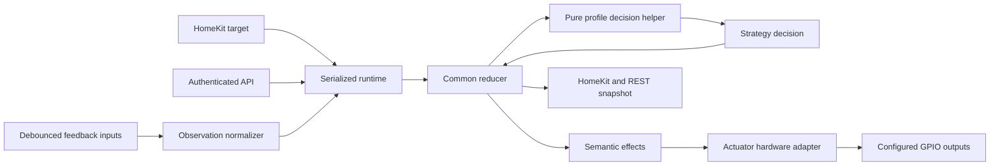

# Operator-profile architecture and implementation plan

## 1. Scope and fixed decisions

This plan extends the gate behavior without implementing it. It is subordinate to the existing product and safety constraints in [the main implementation plan](implementation-plan.md) and preserves the confirmed Ducati behavior in [the Ducati logic note](../docs/ducati-gate-logic.txt).

In scope:

- semantic actuator commands independent of GPIO layout;
- sequential single-output and directional OPEN/CLOSE-output profiles;
- one configurable endpoint input or separate OPENED/CLOSED inputs;
- normalized observations before gate-state reduction;
- schema-v3 configuration with automatic migration of valid v1/v2 sequential configurations;
- backward-compatible REST representations and conditional Svelte forms;
- host, firmware, and bench tests;
- behavior-focused commits isolated from management-plane extraction.

Fixed decisions:

1. The existing sequential profile retains exactly its present semantics: a target-changing command produces at most one STEP pulse; an opposite target during travel pauses; a later explicit command may reverse; no automatic corrective pulse exists.
2. The directional profile uses separate OPEN and CLOSE pulse outputs. An opposite target during travel produces exactly one pulse on the requested output and immediately reports the requested direction. The physical operator must be documented and configured only if it safely supports that direct reversal behavior.
3. Separate OPENED and CLOSED feedback asserted simultaneously, after debounce and endpoint stability, is a contradictory-feedback fault. It cancels travel timers, reports STOPPED plus obstruction, rejects movement and maintenance commands until the contradiction clears, and never causes an automatic pulse.
4. Actuator topology and feedback topology are orthogonal. All four combinations are supported:
   - sequential actuator plus single endpoint feedback;
   - sequential actuator plus dual endpoint feedback;
   - directional actuator plus single endpoint feedback;
   - directional actuator plus dual endpoint feedback.
5. The pinned HomeSpan submodule is read-only. No file below `third_party/HomeSpan` is changed.
6. Completed management cleanup for `bootstrap_credentials`, `network_manager`, and `captive_dns` is left intact. Pending `web_auth`, `web_server`, `setup_api`, and `management_api` extraction is not mixed into these commits. Existing handlers may be minimally adapted in place and extracted later in behavior-preserving commits.

## 2. Problems in the current boundary

The current implementation is safe for one relay and one sensor, but physical details leak through every layer:

- [the v2 configuration model](../components/app_config/include/app_config.hpp) exposes singular `relay` and `sensor` members;
- [the reducer effect](../components/gate_controller/include/gate_controller.hpp) is the physical boolean `start_pulse` rather than a semantic command;
- [the reducer snapshot](../components/gate_controller/include/gate_controller.hpp) stores `feedback_active`, whose meaning depends on configuration outside the reducer;
- [the runtime](../components/gate_runtime/gate_runtime.cpp) translates sensor polarity/endpoint meaning and directly calls one-relay hardware functions;
- [the hardware API](../components/gate_hardware/include/gate_hardware.hpp) can activate only one unnamed relay and observe one unnamed input;
- [the REST handlers](../components/provisioning/provisioning.cpp) and [the Svelte form](../webui/src/App.svelte) assume one relay and one sensor;
- maintenance pulse has no semantic channel, which becomes ambiguous with directional outputs.

The extension should remove those assumptions once, not duplicate the reducer or runtime for each wiring variant.

## 3. Architectural shape

Use three explicit transformations:

1. **Configuration describes semantic bindings**: STEP, OPEN, and CLOSE actuator meanings; OPENED and CLOSED feedback meanings.
2. **Hardware reports electrical assertions, then an observation normalizer produces one domain observation**: OPENED, CLOSED, BETWEEN, or CONTRADICTORY. Observation validity is tracked separately before the first stable result.
3. **A pure profile decision helper maps target intent to one semantic actuator command** while the common reducer owns state, target, movement direction, obstruction/fault, idempotency, and timer effects.



Dependency direction:

- `app_config` defines persisted configuration and validates bindings.
- `gate_controller` defines domain vocabulary, observation normalization, profile strategy, and the pure reducer. It has no ESP-IDF, GPIO, NVS, HTTP, Svelte, or HomeSpan dependency.
- `gate_hardware` consumes validated bindings and performs electrical I/O only.
- `gate_runtime` is the sole owner of reducer state, deadlines, pulse admission, and side-effect execution.
- `homespan_bridge` and management handlers translate external requests and project snapshots; they do not select GPIOs or infer profile behavior.

## 4. Domain vocabulary

### 4.1 Semantic actuator commands

Add a domain enum in `gate_controller`:

| Value | Meaning | Valid profile |
|---|---|---|
| `NONE` | no physical action | all |
| `STEP` | one sequential operator input pulse | sequential |
| `OPEN` | one pulse on the dedicated open input | directional |
| `CLOSE` | one pulse on the dedicated close input | directional |

The reducer effect becomes `actuator_command` instead of `start_pulse`. `NONE` avoids optional/heap machinery in the embedded path. A transition is pulse-producing exactly when this field is not `NONE`.

Do not call these values relay 1/relay 2 or primary/secondary in domain code. GPIO assignment is a hardware/configuration concern. This permits future command meanings, such as a dedicated STOP input, without redefining target intent or the runtime/hardware boundary.

### 4.2 Normalized endpoint observations

Replace the domain-level feedback boolean with:

| Observation | Meaning |
|---|---|
| `BETWEEN` | dual feedback is valid but neither endpoint is asserted |
| `OPENED` | stable evidence proves fully open |
| `CLOSED` | stable evidence proves fully closed |
| `CONTRADICTORY` | dual feedback asserts both mutually exclusive endpoints |

`UNKNOWN` is deliberately not an observation value. Before the first stable result, the snapshot has `observation_valid == false`; after stability, `observation_valid == true` and `stable_observation` contains one table value. `BETWEEN` is therefore distinguishable from absence of trustworthy evidence without inventing a hardware result that can never be sampled. Neither an invalid observation nor BETWEEN invents external travel direction.

Normalization rules:

| Feedback topology | Debounced assertions | Pending observation |
|---|---|---|
| single, asserted endpoint OPENED | active | OPENED |
| single, asserted endpoint OPENED | inactive | CLOSED |
| single, asserted endpoint CLOSED | active | CLOSED |
| single, asserted endpoint CLOSED | inactive | OPENED |
| dual | opened only | OPENED |
| dual | closed only | CLOSED |
| dual | neither | BETWEEN |
| dual | both | CONTRADICTORY |

This deliberately preserves current single-feedback behavior: after the stability filter, both electrical levels prove one of the two endpoints. The dual topology is more conservative: neither asserted proves only BETWEEN, never an endpoint.

### 4.3 Pending versus stable observation

The hardware layer debounces each electrical input independently and publishes one complete assertion sample. A pure normalizer maps that sample to a pending observation. The runtime compares it with the current pending observation:

1. pending observation changed: enqueue/store `OBSERVATION_CHANGED`, restart one endpoint-stability deadline;
2. same pending observation: do nothing;
3. deadline expires and pending observation still matches: enqueue/apply `OBSERVATION_STABLE`;
4. stable observation becomes authoritative in the reducer.

This keeps the existing Ducati movement-blink filter. Do not run separate endpoint-stability timers whose expirations can race. Input debounce is per GPIO; semantic stability is one timer over the combined observation.

## 5. Configuration schema v3

### 5.1 Canonical in-memory model

Set the application schema version to 3 and replace singular relay/sensor ownership with one canonical operator configuration. Recommended model:

- `OperatorProfile`: `SEQUENTIAL` or `DIRECTIONAL`.
- `FeedbackTopology`: `SINGLE` or `DUAL`.
- `PulseOutputConfig`: GPIO, active level, pulse duration.
- `ActuatorBinding`: semantic command plus `PulseOutputConfig`.
- `FeedbackInputConfig`: semantic asserted endpoint, GPIO, active level, pull, and debounce.
- `OperatorConfig`:
  - profile;
  - fixed-capacity actuator bindings with count, maximum two active bindings;
  - feedback topology;
  - fixed-capacity feedback bindings with count, maximum two active bindings;
  - endpoint stability duration;
  - one global minimum pulse-start interval shared by every output.

Derive one immutable `OperatorCapabilities` value from validated configuration during startup rather than repeatedly inspecting binding arrays. At minimum it contains `supports_step`, `supports_open`, `supports_close`, `supports_dual_feedback`, and a command-to-binding lookup result. Configuration remains authoritative; capabilities are a non-persisted compiled view passed to strategy, runtime, hardware, REST capability reporting, and maintenance-command validation. Capability derivation must fail if configuration is incomplete or contradictory and must not silently repair it. This creates the extension point for future STOP, pedestrian, latch, bus, or expander bindings without scattering profile checks.
- existing `TimingConfig`: opening timeout, closing timeout, and any retained start/release timeout.

Use fixed-capacity arrays rather than dynamic polymorphism or heap-owned strategy objects. Validation guarantees exact binding sets:

| Profile/topology | Required semantic bindings |
|---|---|
| sequential | exactly STEP actuator |
| directional | exactly OPEN and CLOSE actuators |
| single feedback | exactly one input bound to OPENED or CLOSED |
| dual feedback | exactly OPENED and CLOSED inputs |

Unused slots are zeroed in persistence and never initialized as GPIOs.

### 5.2 Validation

Extend authoritative validation in `app_config` with field-specific errors:

- reject unknown enum values, duplicate meanings, missing required meanings, extra bindings, and invalid binding counts;
- validate every active output GPIO as output-capable and every active feedback GPIO as input-capable;
- reject collisions across all active outputs and feedback inputs, not only relay versus sensor;
- preserve GPIO34–39 pull restrictions independently for each input;
- validate pulse duration per active output;
- use one global minimum interval so alternating OPEN/CLOSE requests cannot evade lockout;
- preserve existing debounce, endpoint-stability, travel-time, credential, and HomeKit validation bounds;
- reject directional configuration unless OPEN and CLOSE are distinct GPIOs;
- reject dual feedback unless OPENED and CLOSED are distinct GPIOs;
- return semantic field paths such as `operator.actuators.open.gpio` and `operator.feedback.closed.pull`.

Do not encode the direct-reversal warning as a bypassable runtime toggle in v3. Selecting the directional profile is the explicit opt-in; the UI must display the safety warning adjacent to that selection and again in review/edit context.

### 5.3 Persisted format and backward-compatible migration

Schema v3 uses a clean durable layout while retaining a one-time decoder for valid v1/v2 data. Legacy configurations migrate to the sequential actuator and single-feedback topology without changing their GPIO, polarity, timing, credential, or HomeKit values.

Use a new NVS blob key such as `config_v3` in the existing `gate_cfg` namespace and define a self-contained packed `PersistedConfigV3`. It contains all existing non-operator settings plus the canonical fixed-capacity operator bindings. Include explicit magic, schema version, actuator count, and feedback count. Zero every unused slot before persistence.

Repository rules:

1. Load only the exact v3 key, exact v3 blob size, expected magic, and schema value 3.
2. Decode enum/count/binding fields defensively, then run full authoritative validation before returning configuration.
3. Save only v3 using the existing atomic NVS blob write/commit behavior.
4. If the v3 key is missing, accept only an exact, valid v1/v2 blob and migrate it to the equivalent sequential/single-feedback v3 configuration.
5. Preserve the old blob after migration for rollback diagnostics; subsequent loads use the successfully committed v3 key.
6. `erase()` continues erasing the complete `gate_cfg` namespace, so factory/testbench reset removes both old and new keys.

Extract pure v3 encode/decode helpers from NVS access so host tests can feed exact valid, truncated, oversized, invalid-enum, invalid-count, and round-trip fixtures. Document the one-time erase/re-provision prerequisite in the implementation handoff and development status.

## 6. Strategy and reducer boundaries

### 6.1 Common reducer ownership

The common pure reducer continues to own:

- gate state and requested target;
- pending observation, stable observation, and stable-observation validity;
- explicit movement direction;
- active semantic pulse command;
- obstruction and structured fault reason;
- boot behavior;
- endpoint proof;
- travel timeout behavior;
- pulse completion;
- idempotent/no-change decisions;
- command rejection while a pulse is active or contradictory feedback is stable.

Add a compact fault reason, at minimum `NONE`, `TRAVEL_TIMEOUT`, and `FEEDBACK_CONTRADICTION`. HomeKit obstruction remains the projection `fault != NONE`; REST may expose both the boolean and redacted reason. Contradiction clearing removes only the contradiction fault. It must not accidentally clear an unrelated timeout without an endpoint proof or explicit existing acknowledgement rule.

Represent movement direction explicitly as `MovementDirection { NONE, OPENING, CLOSING }`. It is not inferred ad hoc from target or feedback. The reducer maintains these consistency rules:

- OPENING state has OPENING direction;
- CLOSING state has CLOSING direction;
- OPEN and CLOSED endpoints have NONE direction;
- stopped states have NONE current direction while retaining a separate `last_movement_direction` when sequential pause/reversal behavior needs history;
- UNKNOWN_STOPPED and contradiction have NONE current direction;
- boot never restores a moving direction.

Keeping current movement separate from `last_movement_direction` avoids describing a physically stopped gate as moving. If implementation retains `STOPPED_OPENING` and `STOPPED_CLOSING` for HomeKit/log compatibility, reducer tests must assert that those presentation states agree with `last_movement_direction`; no caller may derive direction independently from target plus observation.

### 6.2 Pure profile decision helper

Put pure profile dispatch beside the reducer, not in runtime or hardware. Model it as a helper computation, not a layer through which the reducer flows. Conceptually:

```text
StrategyDecision decision = compute_strategy_decision(
    profile, capabilities, snapshot, requested_target);
apply_strategy_decision(transition, decision);
```

The helper receives profile, derived capabilities, current domain snapshot, and requested target, then returns an immutable decision containing:

- command result;
- semantic actuator command or NONE;
- next state and target;
- travel timer to start/cancel.

The common reducer applies universal interlocks first, calls the helper only for an admissible target request, validates that the returned command is supported by capabilities, and then applies the decision to its proposed transition. The helper never mutates a snapshot, reducer transition, timer, or hardware. A switch over `OperatorProfile` is preferable to virtual classes: there are two closed variants, no heap ownership, and host tests can exercise every branch. Keep each profile decision table in a separate source file if it becomes large.

### 6.3 Sequential strategy

Move the existing behavior without semantic changes:

- endpoint-to-opposite target: STEP, begin requested direction, start corresponding timeout;
- repeated effective target: no change and no command;
- opposite target while moving: STEP, enter corresponding stopped state, retain the directional target that allows a later explicit opposite selection, cancel travel timers;
- second explicit opposite selection from stopped: STEP, begin reverse movement;
- unknown/stopped handling preserves current conservative one-command behavior;
- every accepted target-changing strategy decision contains exactly one STEP command.

The existing sequential tests are retained as regression tests, not rewritten to directional expectations.

### 6.4 Directional strategy

Directional behavior:

| Current state | Requested target | Semantic command | Next state |
|---|---|---|---|
| CLOSED | CLOSED | NONE | CLOSED |
| CLOSED | OPEN | OPEN | OPENING |
| OPEN | OPEN | NONE | OPEN |
| OPEN | CLOSED | CLOSE | CLOSING |
| OPENING | OPEN | NONE | OPENING |
| OPENING | CLOSED | CLOSE | CLOSING immediately |
| CLOSING | CLOSED | NONE | CLOSING |
| CLOSING | OPEN | OPEN | OPENING immediately |
| stopped/unknown with changed target | OPEN | OPEN | OPENING |
| stopped/unknown with changed target | CLOSED | CLOSE | CLOSING |

On direct reversal, cancel the old travel deadline and start the new direction deadline in the same committed transition. There is no intermediate STOPPED publication and no second pulse. A rejected pulse admission or GPIO activation failure prevents the transition commit, so state and target cannot claim reversal unless the requested output actually started.

### 6.5 Observation reduction

When a pending observation becomes stable:

- OPENED: state OPEN, target OPEN, cancel travel timers, clear endpoint-resolved timeout obstruction as currently defined;
- CLOSED: state CLOSED, target CLOSED, cancel travel timers, clear endpoint-resolved timeout obstruction as currently defined;
- BETWEEN: record stable observation but do not invent state or external movement direction; locally initiated OPENING/CLOSING may continue until endpoint proof or timeout; at boot remain UNKNOWN_STOPPED;
- CONTRADICTORY: enter a stopped state that preserves the last known movement direction where possible, set `FEEDBACK_CONTRADICTION`, cancel travel timers, and engage command interlock;
- an invalid stable observation is initialization state only and is never emitted as a proved hardware event.

When contradiction clears to another stable observation, remove the command interlock. An endpoint observation establishes the endpoint normally. Stable BETWEEN clears only the contradiction fault and leaves state UNKNOWN_STOPPED or the stopped directional state; it does not resume a canceled timer or movement.

## 7. Runtime API and event model

Retain one FreeRTOS owner task and one event queue. Evolve the public/runtime contracts as follows:

- `request_target(target)` remains unchanged for HomeKit and normal management callers.
- replace ambiguous `request_bench_pulse()` internally with `request_maintenance_command(command)`.
- optionally retain `request_bench_pulse()` as a sequential-only compatibility wrapper that requests STEP and returns unavailable/invalid for directional configuration.
- add `INVALID_COMMAND` or `INTERLOCKED` request results rather than collapsing configuration mistakes and safety faults into BUSY.
- runtime snapshots expose normalized stable observation, active semantic actuator command, pulse active, fault reason, state, target, and obstruction compatibility boolean.
- callback/event payloads carry a complete debounced assertion sample or normalized pending observation, never a bare feedback boolean.

Pulse execution order remains safety-critical:

1. reduce request to a proposed transition;
2. if no semantic command, commit the state-only/no-change result;
3. apply global pulse guard before snapshot commit;
4. ask hardware to activate exactly the semantic command;
5. on failure, force all outputs inactive and do not commit proposed movement/target state;
6. on success, mark global pulse guard, arm one pulse deadline using that command binding's duration, then commit transition;
7. on deadline, deactivate all outputs before delivering pulse-completed to the reducer;
8. never queue a rejected command for later replay.

Travel and observation-stability deadlines remain runtime concerns requested by reducer effects. A contradiction cancels both opening and closing deadlines. Wrap-safe deadline and pulse-interval arithmetic remains required.

## 8. Hardware API

Replace unnamed relay/sensor functions with a narrow semantic adapter:

- initialize all configured outputs inactive and all configured inputs before monitoring starts;
- activate one `ActuatorCommand` only if it has exactly one validated binding;
- deactivate all outputs as the fail-safe operation;
- report the currently active semantic command or NONE;
- expose monitoring health and the latest complete debounced assertion sample;
- callback with the complete sample whenever either debounced input changes.

Initialization rules:

1. Calculate every inactive electrical level first.
2. For each configured output, set its latch inactive before enabling output mode, then set it inactive again.
3. Keep outputs inactive while configuring feedback inputs and creating tasks.
4. If any output/input setup fails, deactivate every output already touched and do not mark monitoring active.
5. Use one hardware monitor task for up to two debouncers so a callback always contains a coherent pair sampled in the same cycle.
6. Do not let GPIO callbacks or the monitor task drive outputs.

Activation rules:

- maintain one atomic active-command state for every output collectively;
- reject activation unless active command is NONE;
- defensively set every non-selected output inactive before asserting the selected output;
- on any GPIO error, attempt `deactivate_all`, clear software active state, and return failure;
- no API exposes raw GPIO activation to HTTP or HomeSpan callers.

## 9. Safety invariants and failure policy

The implementation is unacceptable unless all of these hold:

1. Boot, reboot, schema cutover/re-provisioning, configuration validation failure, Wi-Fi/HomeSpan restart, and management restart activate no output.
2. One accepted target-changing command starts at most one semantic output pulse.
3. No timeout, endpoint observation, pulse completion, fault clear, or retry path starts a pulse.
4. Rejected/busy/interlocked commands are not delayed or replayed.
5. Only one physical output may be active at once, including during errors and OPEN/CLOSE alternation.
6. One global minimum interval applies across all outputs.
7. A movement/state transition requiring a pulse is committed only after GPIO activation succeeds.
8. Stable contradiction cancels travel timers, obstructs, and blocks all target and maintenance pulses until stable non-contradictory feedback replaces it.
9. Clearing contradiction never resumes prior movement, restarts a timer, or emits a pulse.
10. Dual-feedback BETWEEN never proves OPEN or CLOSED and never invents external direction.
11. Travel expiry remains a fault timeout, never successful endpoint inference.
12. Sequential behavior remains one pulse to pause and requires a later explicit pulse to reverse.
13. Directional direct reversal emits only the requested OPEN or CLOSE pulse; it never emits STOP first and never claims compatibility with an operator that cannot safely reverse.
14. Maintenance commands pass through the same queue, contradiction interlock, overlap guard, global interval, pulse timer, and fail-safe deactivation as target commands.
15. HomeSpan remains a projection/request adapter; no changes are made to the pinned submodule.
16. Every reducer transition is atomic. Reduction computes one complete proposed next snapshot and effect set from one immutable current snapshot plus one event. No observer may see a partially applied target, state, direction, observation, fault, pulse, or timer decision. The runtime either rejects the proposal without changing the committed snapshot, or completes required pre-commit pulse admission/activation and commits the entire next snapshot once under its snapshot lock. Effect execution must preserve this contract: failed preconditions produce no state commit, and post-commit timer bookkeeping cannot expose an intermediate reducer state or synthesize a second transition.

## 10. REST compatibility contract

Keep all current `/api/v1` paths and authentication/CSRF behavior. Do not use this work to extract pending management components.

### 10.1 Configuration GET

Add canonical v3 fields while retaining existing flat fields for released clients:

- `schemaVersion: 3`;
- `operatorProfile: sequential | directional`;
- `feedbackMode: single | dual`;
- `actuators`, keyed by semantic command, with GPIO, active-high flag, and pulse duration;
- `feedbackInputs`, keyed by semantic endpoint, with GPIO, active-high flag, pull, and debounce;
- existing endpoint stability and travel fields;
- one canonical `capabilities` object derived by firmware, including supported commands, dual-feedback support, and available maintenance commands. The browser uses it for affordances but never treats it as a substitute for the profile/topology discriminators or server validation.

For a sequential/single configuration, continue returning `relayGpio`, `relayActiveHigh`, `pulseMs`, `sensorGpio`, `sensorActiveHigh`, `sensorPull`, `feedbackActiveEndpoint`, and `feedbackStabilityMs` with exactly their current meaning. For configurations that cannot be represented by legacy singular fields, return slot-A values in those fields only for display compatibility and set an explicit `legacyFlatConfigLossy: true`; new UI code must prefer canonical v3 fields whenever `schemaVersion >= 3`.

Never silently reconstruct directional or dual configuration from only the lossy aliases on update.

### 10.2 Configuration PUT and first-time save

Continue accepting `application/x-www-form-urlencoded` to avoid introducing a JSON parser in this behavior change.

- If `operatorProfile` and `feedbackMode` are absent, parse the existing flat payload exactly as a sequential/single update. This preserves old UI/client behavior.
- If either discriminator is present, require both and require exactly the fields visible for those discriminators.
- Sequential requires STEP fields and rejects submitted OPEN/CLOSE fields.
- Directional requires complete OPEN and CLOSE fields and rejects STEP fields.
- Single feedback requires one endpoint discriminator and one complete input.
- Dual feedback requires complete OPENED and CLOSED inputs and rejects a single active-endpoint discriminator.
- Parse into a fresh candidate operator config rather than mutating selected old fields, then run authoritative full validation.
- Keep existing response status and `{saved:true}` success body.
- Return semantic field names in validation errors; retaining the current text body is acceptable until the later API extraction standardizes machine-readable errors.

Configuration changes still take effect according to the existing restart behavior. Do not attempt live GPIO reconfiguration as part of this feature unless a separate design and safety test is approved.

### 10.3 Runtime GET

Retain `hardwareMonitoring`, `feedbackActive`, and `relayControlEnabled`. Add:

- `observation`;
- `openedAsserted` and `closedAsserted`, using null for an unconfigured semantic input;
- `activeCommand`;
- `pulseActive`;
- `state`, `target`, `obstruction`, and `faultReason` from the runtime snapshot.

For single feedback, `feedbackActive` remains the configured input's electrical semantic assertion. New UI uses `observation` for gate status.

### 10.4 Maintenance pulse

Keep `POST /api/v1/gate/test-pulse`:

- sequential: an omitted `command` remains backward compatible and means STEP;
- directional: require `command=open` or `command=close`; omission is rejected as ambiguous;
- reject a command not supported by the active profile;
- preserve authentication, CSRF, accepted/busy/hardware/unavailable status behavior and add a conflict response for contradiction interlock;
- responses may include the accepted semantic command without removing `accepted:true`.

## 11. Svelte UI model

Keep conditional rendering driven by two discriminators, not scattered checks against GPIO presence:

- `operatorProfile` selects one STEP actuator card or OPEN and CLOSE actuator cards;
- `feedbackMode` selects one endpoint input card plus an “active means” selector, or separate OPENED and CLOSED input cards;
- shared timing and endpoint-stability controls remain outside those branches.

Introduce small UI model helpers, either at the top of [the existing Svelte component](../webui/src/App.svelte) for the first implementation or in a focused module if permitted by the implementation commit:

- normalize canonical v3 GET data into one form model;
- normalize flat compatibility fields as sequential/single when canonical v3 fields are absent;
- produce URL-encoded fields for only the selected branches;
- validate duplicate GPIOs across every visible active binding before submit;
- reset or preserve hidden branch drafts explicitly, but never submit hidden stale controls.

Recommended model shape:

- `operator.profile`;
- `operator.actuators.step`, `.open`, `.close` where only profile-relevant entries are submitted;
- `feedback.mode`;
- `feedback.single.endpoint` and `.input`, or `.opened` and `.closed`;
- `feedback.stabilityMs`;
- existing timing fields.

UI behavior:

1. Default first-time setup remains sequential plus single CLOSED feedback, preserving current operator expectations.
2. Profile change updates visible actuator cards immediately.
3. Each profile option includes a small accessible wiring diagram, rendered with local HTML/CSS or embedded SVG: sequential shows ESP32 → relay → STEP; directional shows separate ESP32 → OPEN relay and ESP32 → CLOSE relay paths. The selected diagram repeats above the GPIO fields and in the review screen. Include equivalent text so the distinction is not visual-only.
4. Selecting directional displays a prominent warning that an opposite target during movement directly pulses the requested direction and is safe only for operators designed for that behavior.
5. Selecting dual feedback explains BETWEEN and contradictory states and shows separate OPENED/CLOSED input wiring.
6. Review/read-only views label semantic channels, not relay 1/relay 2.
7. Runtime status shows the normalized observation and explicitly identifies contradiction as an interlocked fault.
8. Maintenance controls show one STEP button or separate “Test OPEN input” and “Test CLOSE input” buttons, each naming GPIO and pulse duration and requiring the existing authenticated/CSRF flow.
9. Disable every maintenance control while contradiction, pulse, runtime-unavailable, or request-in-flight state is present.
10. Preserve phone-width, keyboard, label, and status accessibility requirements.

## 12. HomeKit projection

HomeKit remains profile-neutral:

- target writes still call the same runtime target API;
- current state, target state, and obstruction derive only from the common snapshot;
- no actuator command or GPIO appears in HomeKit code;
- directional direct reversal publishes the new requested movement state after pulse admission succeeds;
- sequential pause continues to publish STOPPED according to its existing strategy;
- contradictory feedback publishes STOPPED plus obstruction and target writes fail while interlocked.

Extend host projection tests for contradiction and both stopped variants. Fixes to the already known HomeKit STOPPED publication defect must remain a separate commit if still pending; do not hide that unrelated behavior fix inside operator-profile work.

## 13. Test plan

### 13.1 Host tests

Configuration and persistence:

- valid sequential/single, sequential/dual, directional/single, and directional/dual v3 configurations;
- missing, duplicate, extra, and unknown semantic bindings;
- all pairwise GPIO collisions across two outputs and two inputs;
- input-only output rejection and GPIO34–39 pull rejection per channel;
- exact v3 binary fixtures, truncated/oversized blobs, invalid schema/enum/count, and v3 round trip;
- old-key-only storage is reported as unprovisioned and never reinterpreted as v3;
- v3 persistence preserves secrets and unrelated configuration fields exactly.

Observation normalizer:

- every single-feedback polarity/endpoint combination;
- all four dual assertion combinations;
- pending-observation changes restart stability;
- stale timer expiry cannot prove a superseded candidate;
- BETWEEN and CONTRADICTORY stay distinct.

Reducer/strategies:

- retain every existing sequential transition test;
- assert semantic STEP rather than a generic pulse boolean;
- directional endpoint commands select OPEN/CLOSE correctly;
- directional opposite requests while moving select one requested command and immediately reverse reported direction/timer effect;
- every state transition maintains current and last-movement-direction consistency;
- idempotent target writes produce NONE;
- pulse-active, global-lockout admission failure, and contradiction interlock do not mutate target/state and never replay;
- stable OPENED/CLOSED endpoint authority under both profiles;
- stable BETWEEN does not infer endpoint/direction;
- stable CONTRADICTORY stops, obstructs, cancels timers, and emits NONE;
- contradiction clear emits NONE and never resumes motion;
- timeout emits NONE under every profile;
- property/table assertion: every reduced event contains zero or one actuator command, never a sequence.
- atomicity assertions: every event returns one self-consistent complete snapshot/effect proposal; rejected pulse admission and GPIO failure leave the previously committed snapshot byte-for-byte/domain-field equivalent; concurrent snapshot readers observe only the old or new committed snapshot, never mixed fields.

Runtime/hardware-contract fakes:

- proposed movement is not committed when semantic binding lookup or GPIO activation fails;
- one global guard blocks rapid OPEN-to-CLOSE alternation;
- pulse completion deactivates all before reducer completion;
- command-specific pulse duration is used;
- maintenance commands use the same admission/interlock path.

REST/UI checks:

- legacy flat PUT creates sequential/single config;
- canonical forms require discriminators and complete visible branches;
- legacy GET aliases remain correct for a sequential/single v3 baseline;
- ambiguous directional maintenance request is rejected;
- UI checker builds every conditional branch with no warnings;
- serialized forms contain no hidden stale branch fields.

### 13.2 Target and bench tests

Use LEDs or disconnected low-risk test loads before attaching an operator:

1. Verify every configured output is inactive through cold boot, reboot, erased/re-provisioned cutover, invalid config, Wi-Fi reconnect, and HomeSpan restart.
2. Verify OPEN and CLOSE outputs are never active together, including activation failure injection where practical.
3. Measure each configured pulse width and the global cross-channel minimum interval.
4. Exercise each input independently with bounce and verify per-input debounce.
5. Exercise dual feedback: opened only, closed only, neither, and both; verify both must survive stability before interlock.
6. While contradictory, verify Apple and maintenance commands produce no GPIO transition; after clearing, verify no prior command is replayed.
7. Verify sequential physical behavior is unchanged on the Ducati operator, including one-pulse pause and explicit later reversal.
8. On a directional-safe operator or isolated simulator, verify OPENING-to-CLOSE and CLOSING-to-OPEN each produce only the requested one output pulse and immediately publish the new direction.
9. Verify external movement reaches endpoints through feedback without firmware-generated pulses; dual BETWEEN does not invent direction.
10. Verify travel timeout reports STOPPED/obstruction and no corrective pulse.
11. Pair with Apple Home without modifying HomeSpan; validate current/target/obstruction publication for both profiles and contradiction.

Run the existing host test, UI check, and exact ESP-IDF firmware build after every behavior commit. Record physical smoke results separately; do not claim target safety from host tests alone.

## 14. Isolated implementation commit sequence

Each commit must compile and pass relevant tests. Do not combine these with the remaining management cleanup.

1. **Add operator-domain vocabulary and observation normalizer**
   - Add semantic actuator command, normalized observation without UNKNOWN, explicit observation validity, pending/stable vocabulary, movement direction, assertion sample, profile/topology enums, capabilities, and pure normalizer.
   - Add exhaustive normalizer host tests.
   - No GPIO, REST, UI, or behavior switch yet.

2. **Add schema-v3 operator configuration and clean NVS cutover**
   - Introduce canonical bindings, validators, a self-contained packed v3 format under a new key, and pure codec fixtures.
   - Reject old-key-only storage as unprovisioned; document that the testbench must be erased/re-provisioned.
   - Adapt existing callers mechanically to canonical accessors/default profile so behavior remains sequential/single.
   - Do not modify management component ownership.

3. **Emit semantic commands from profile strategies**
   - Extract present target behavior into the sequential pure decision helper without changing transitions.
   - Add the directional decision helper and common reducer interlocks/fault reason.
   - Replace raw feedback boolean events with normalized pending/stable observation events and explicit observation validity.
   - Make current and last movement direction reducer-owned invariants.
   - Expand reducer and HomeKit projection host tests.

4. **Generalize hardware for semantic outputs and feedback samples**
   - Safely initialize up to two outputs and two inputs.
   - Add coherent dual-debouncer sampling, semantic activation, deactivate-all, and active-command reporting.
   - Keep target callers unable to access GPIO primitives.

5. **Integrate runtime strategy, stability, and global pulse safety**
   - Route normalized samples, one stability deadline, semantic pulse duration, global guard, contradiction interlock, and snapshot fields through the sole owner task.
   - Preserve admission-before-commit and no-replay behavior.
   - Add runtime contract/fake tests where practical and build firmware.

6. **Extend existing REST handlers compatibly**
   - Add canonical v3 GET/runtime fields, retain legacy aliases, parse legacy and discriminated forms, and make maintenance commands semantic.
   - Keep routes, auth, CSRF, server ownership, and current response compatibility.
   - Do not extract `web_auth`, `web_server`, `setup_api`, or `management_api` here.

7. **Add conditional Svelte operator configuration**
   - Add discriminated UI model, conditional setup/edit/read-only cards, warnings, runtime observations, and semantic maintenance controls.
   - Verify legacy GET normalization and branch-clean form serialization.

8. **Bench-validate profiles and document operator safety**
   - Run target tests, capture pulse/interlock results, update hardware/operator documentation and development status.
   - Keep any discovered behavior fix in its own follow-up commit.

9. **Resume management-plane cleanup separately**
   - Only after operator behavior commits are stable, continue from `web_auth` onward under the existing section 6.1 plan with behavior-preserving extractions.

## 15. Acceptance checklist

- An erased testbench provisions directly into a validated self-contained v3 blob; old-key-only storage is not misread.
- Existing REST client/UI flat payload remains valid for sequential/single.
- All four actuator/feedback combinations validate and are configurable.
- Reducer and HomeKit operate only on semantic commands and normalized observations.
- Directional reverse request produces exactly one requested-direction pulse and no STOP/correction pulse.
- Sequential reverse still requires pause then a later explicit command.
- Stable dual contradiction blocks every actuator path, stops/obstructs, and clears without replay.
- At most one output is active, with one global cross-output interval.
- Boot and failures leave all outputs inactive.
- Every reducer transition is committed atomically; readers can observe only complete pre-transition or post-transition snapshots.
- UI conditionals are discriminator-driven and never submit hidden stale fields.
- No pending management cleanup refactor is mixed into behavior commits.
- No pinned HomeSpan file is modified.
